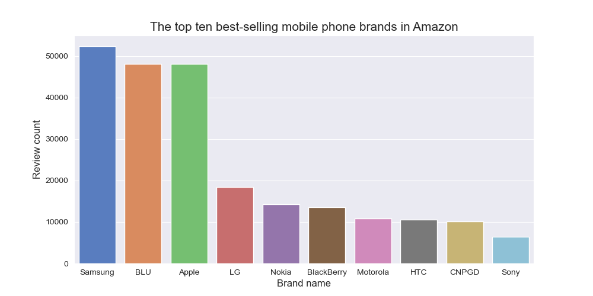
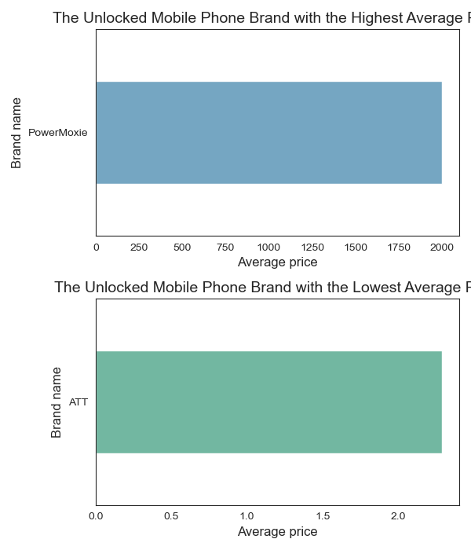
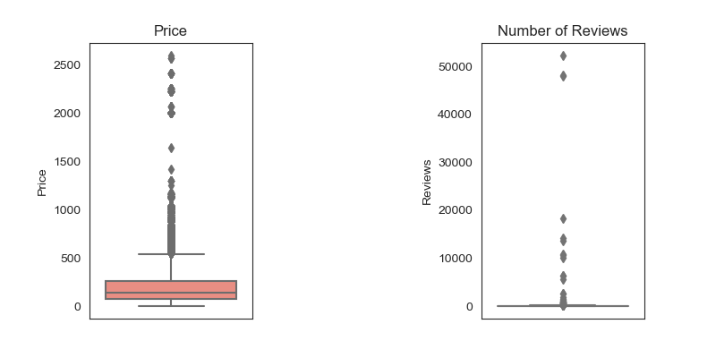
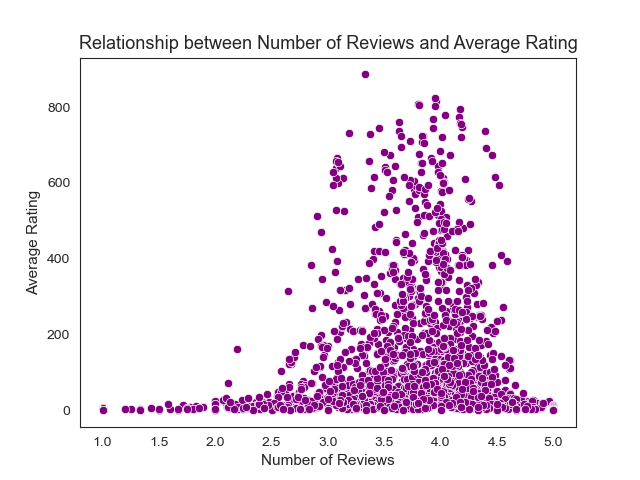

# Analyzing of the price, Ratings and Reviews for Unlocked Mobile Phones on Amazon.

> ## Introduction

* The dataset utilized in this project revolves around mobile phones sold on the popular e-commerce platform, Amazon. Specifically, the dataset focuses on unlocked mobile phones, comprising close to 4,400 listings. This dataset offers a diverse collection of products from various brands, providing valuable insights into the unlocked mobile phone market."Unlocked mobile phone" refers to a mobile phone that is not tied to a specific carrier or network provider.
> ## Souce of Dataset
  * we collected the dataset from [Kaggle.com](https://www.kaggle.com/datasets/PromptCloudHQ/amazon-reviews-unlocked-mobile-phones)
> ## Size of Dataset
* size of this dataset is 125.8 MB
>##  About the Dataset 
* This dataset have more than 400,000 reviews from Amazon's unlocked mobile phone category.
* Dataset contains 6 columns namely - 'Product Name','Brand Name','Price','Rating','Reviews' and 'Review Votes'.
> ## Libraries Used
* Numpy
* Pandas
* Matplotlib
* Seaborn

> ## Exploratory Data Analysis
####  What are the top 10 best-selling mobile phone brands in Amazon based on the number of reviews?

* From the above graph, we observe that Samsung is the highest-selling mobile phone brand among the top ten best-selling brands on Amazon. This observation highlights Samsung's strong performance in the market.
  
####  Which unlocked mobile phone brand has the highest average price?

*  From the two graphs above, we can see that the PowerMoxie mobile phone brand has the highest average price (2000 Dollar), while the ATT mobile phone brand has the lowest average price (around 2.5 Dollar).
  
####  Are there any outliers in terms of price and number of reviews?

* From the above graph, we can see that both the price and number of reviews columns have outliers.

#### Is there a relationship between the number of reviews a product receives and its average rating?

* From the above graph we can see a weak positive relationship between the average rating and number of reviews column.
